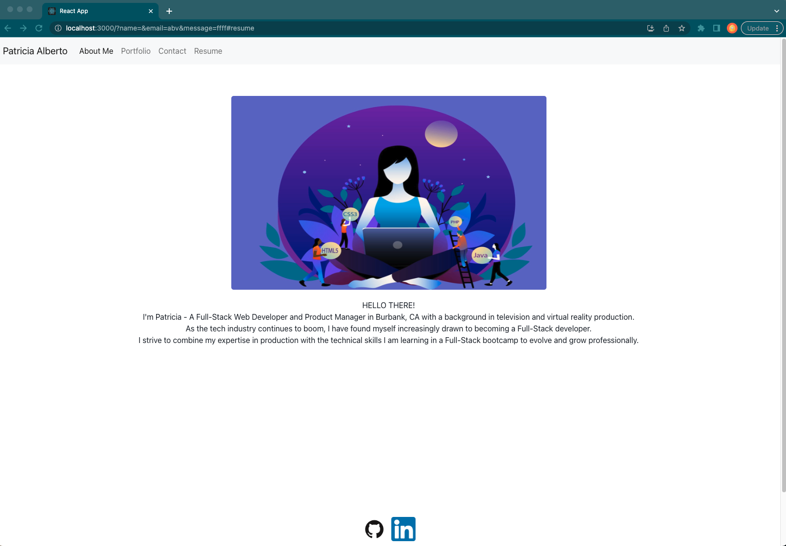
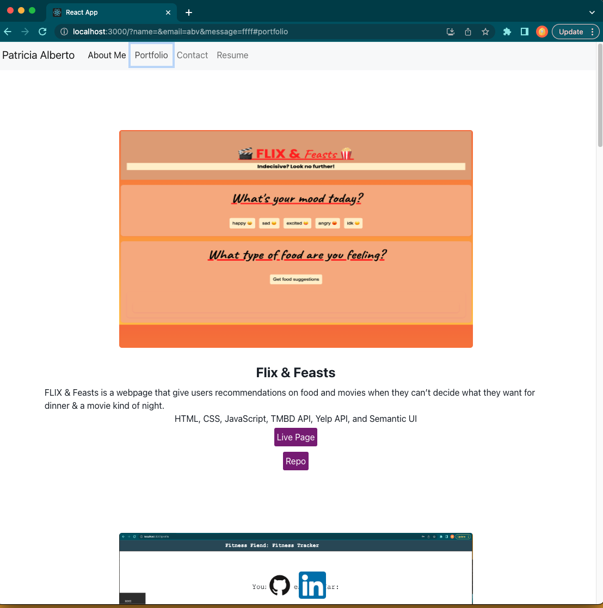
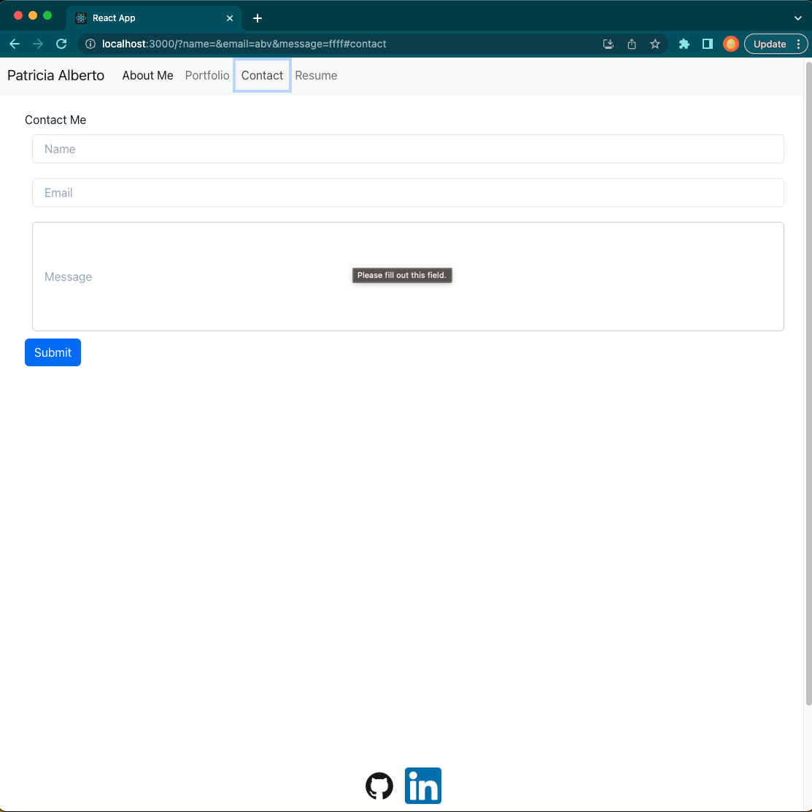
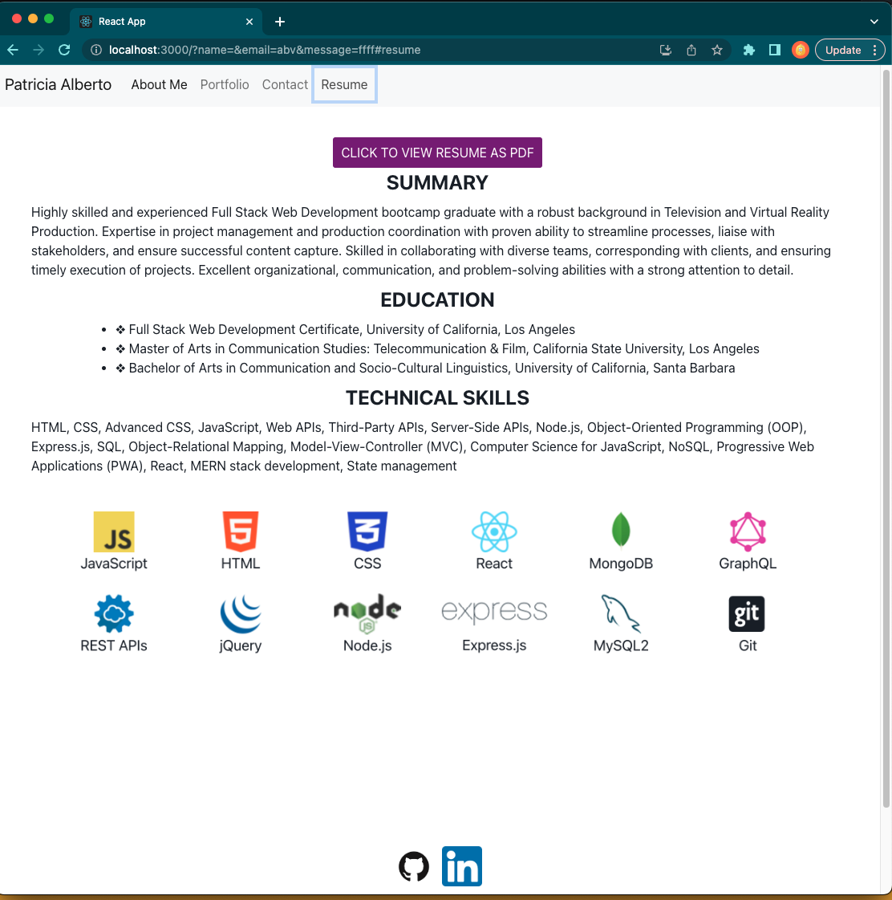

# Patricia-Alberto-Portfolio

## Description

Hello World! This is my professional portfolio.  
My motivation for creating this project is to showcase all the projects I have built during the UCLA Full Stack Bootcamp while demonstrating the skills I learned in React to develop my professional portfolio.  

## Installation

Use the command 'npm i' to install packages and dependencies needes for this project:
@chakra-ui/react
@react-bootstrap 
@ootstrap

run 'npm run start' in command line from root folder to spin up webpage 

## Usage

LINK TO DEPLOYED APPLICATION: 

When an employer arrives on the landing page of my portfolio they are met with the "About Me" page.  In the header is a navigation bar with links to my Portfolio of projects on display, Contact Page with form to reach me and leave a message, and Resume page with a link to a .pdf file of my resume.  On every page is the footer with the GitHub and LinkedIn logos with links to my GitHub and LinkedIn pages embedded. 

On the portfolio page is six web applications that I have built.  Each project has a description, lists tech used, and has links to the the deployed website and repository. 

On the Contact Page is a form that requires user input of their name, email, and a message they'd like to send.  All fields must be filled out in order to submit the form.  

The Resume page contains a link to view my resume as a PDF file.  It also lists a summary of what to find on my resume including education and technical skills.  

## Credits

Special shout outs go to: 

- Bobbi Tarkany for tutoring helping me get started on this project
- Ryan Fernandez for tutoring hepling me finish this project
- Bootstrap was used for styling
- chakra-ui was used for the contact form 

## License

Please refer to MIT License in the repo. 

## Questions

If you have any questions, please feel free to contact me at pkfalberto@gmail.com or visit my GitHub here: https://github.com/P-Trish
